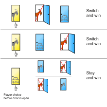
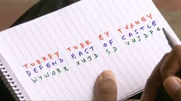
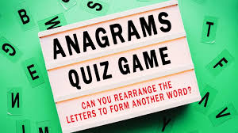
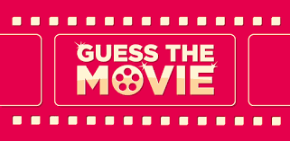
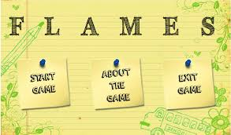
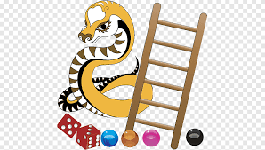
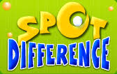
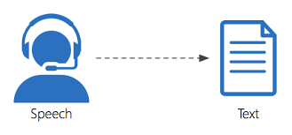
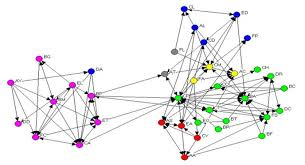

<h1 align="center">Games Made In Python</h1>
<h4 align="center">Games Made in Python Programming Language using different Python Libraries</h4>
 

 

<h2>1. Monty Hall</h2>

  In these we have three gates to come out of the monte hall,
now there is a suspense in this is that only from one door one can come out of the door,
now you have to choose the gate from which you want to come out from this.
If you want to change your answer you can otherwise you can continue with your answer.
This will continue for 5 times.\n\n door1: 0, door2: 1, door3: 2
  

  

  

  
  
 

<h2>2. Rock Paper Scissor</h2>

 Rock paper scissors is a hand game usually played between two people, in which each player simultaneously forms one of three shapes with an outstretched hand. These shapes are "rock" (a closed fist), "paper" (a flat hand), and "scissors" (a fist with the index finger and middle finger extended, forming a V).
  

  

  

  
   

<h2>3. The Science of Secrecy</h2>

 In this we are converting the text in a code language that only selected person can understand instead of all.
  

  

  

  
  

<h2>4. Anagram Checker</h2>

 Anagram is a word, phrase, or name formed by rearranging the letters of another, such as spar, formed from rasp.
  In this, It just check whether the particular word is anagram or not.
  

  

  

  
   

<h2>5. Guess The Movie Name</h2>

 In this your are given with a string containing '*' using the length of this string you have to guess the movie name. You can guess letter by letter.
  

  

  

  
   

<h2>6. Jumbled Words Game</h2>

 In this game you are given the jumbled words you have to guess the word.
  

  

  

  
    

<h2>7. FLAMES</h2>

 FLAMES is a game named after the acronym: Friends, Lovers, Affectionate, Marriage, Enemies and Sister. This game does not accurately predict whether or not an individual is right for you, but it can be fun to play this with your friends.
  

  

  

  
    

<h2>8. Snake And Ladder Game</h2>

 The object of the game is to navigate one's game piece, according to die rolls, from the start (bottom square) to the finish (top square), helped by climbing ladders but hindered by falling down snakes.
  

  

  

  
    

<h2>9. Tic-Tac-Toe</h2>

 Tic-tac-toe is a fun game that you can play any time and anywhere as long as you have a piece of paper, a pencil, and an opponent. Tic-tac-toe is a zero sum game, which means that if both players are playing their best, that neither player will win.
  

  

  

  
   

<h2>10. Spot the Difference</h2>

 In this we are given with the random word of list everytime containing a sequence between them and one letter is not following that sequence. We just have to find that Letter.
  

  

  

  
   

<h2>11. Speech Recognition</h2>

 Speech recognition is the ability of a machine or program to identify words and phrases in spoken language and convert them to a machine-readable format.
  

  

  

  
   

<h2>12. Network Analysis</h2>

 Network analysis (NA) is a set of integrated techniques to depict relations among actors and to analyze the social structures that emerge from the recurrence of these relations. The basic assumption is that better explanations of social phenomena are yielded by analysis of the relations among entities.
  

  

  

  
  
